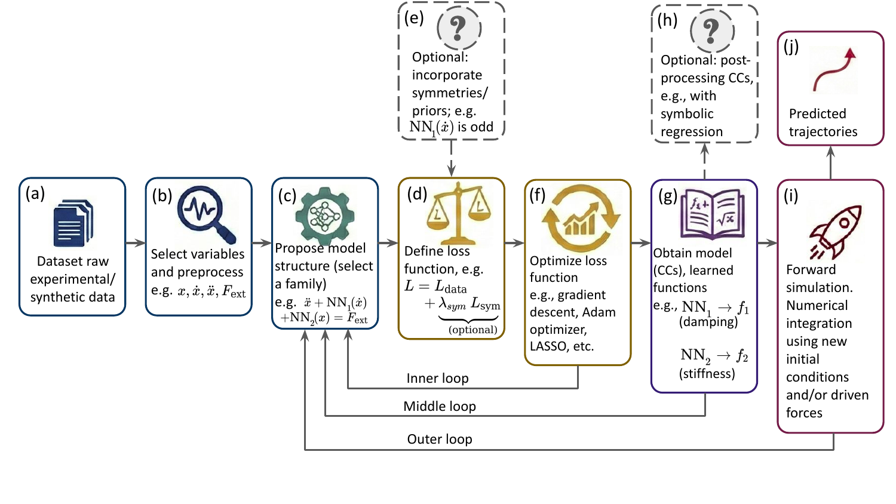
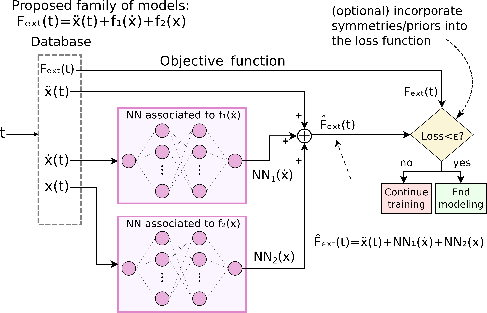

========
✏️ pyCC
======== 

**pyCC** is a user-friendly Python library for data-driven equation discovery.

It is designed to address the critical challenges of **identifiability**, **physical consistency**, and **interpretability**. Its **modular** structure allows practitioners to benefit from **universal approximators**, such as Neural Networks, in a **transparent** way for system identification.

===========
🎯 Why pyCC
===========

------------------------
i) Identifiability
------------------------

When inferring dynamical equations from real experiments (often with finite sampling or noisy data) multiple distinct mathematical models can fit the observations with comparable accuracy. This leads to **ambiguity in model selection**, also referred to as the **identifiability challenge**. This issue is intrinsically connected to the **ill-posed nature of the inverse problem**.

**pyCC** addresses this issue by injecting **prior physical knowledge** or **hypotheses** into the discovery process by defining a structural 'skeleton'.

The choice of the structural skeleton directly affects identifiability: some equation forms admit unique decompositions, whereas others may lead to non-identifiable or ambiguous representations.  When the hypothetized model structure possess uniqueness properties, **pyCC** provides a formal framework to assess whether the proposed equation is consistent with the data. This enables the rigorous validation or elimination of hypothesized models, thereby shedding light to the identifiability challenge. 

------------------------
ii) Physical consistency
------------------------

To define physically motivated model structures, the formalism of **Characteristic Curves (CCs)** is ideal.

This formalism is based on a decomposition of high-dimensional, multivalued dynamics into modular, **univariate functions** referred to as CCs. In this view, each CC represents a constitutive relation of an independent physical element (e.g., a specific spring or a specific damper).

By enforcing this decomposition, we define model structures that, apart from having uniqueness properties, yield functions that possess inherent physical meaning. This assures **physical consistency**: the learned model is not just a curve fit, but a collection of distinct physical mechanisms.

------------------------
iii) Interpretability
------------------------
The use of CCs allows the practitioner to 'visualize' the model simply by plotting the univariate curves. This offers a visual tool that significantly enhances **interpretability**. 
This has a simple but profound implication: the objective shifts from finding precise parameter values that represent the CCs to finding the **shape** of the functions themselves.

* **Traditional approach:** "Find the coefficients :math:`k` and :math:`c` assuming linear dynamics."
* **pyCC approach:** "Find the *shapes* of the stiffness and damping curves."

If the stiffness curve comes out looking like a line, we know the system is linear. If it looks like a parabola, we know it is nonlinear. This visual insight allows for qualitative discovery before quantitative fitting.

---------------------------------------------
iv) Modularity, Universality and Transparency
---------------------------------------------

Since **pyCC** prioritizes the **shape** of the constitutive relations over their specific model coefficients, the specific **parametric form** of the curves (e.g., whether they are polynomial, exponential, or trigonometric) does not need to be postulated *a priori*. This flexibility unlocks a highly **modular** approach that can be implemented using different modeling paradigms.

For example, we can parameterize the CCs using **universal approximators**, such as Neural Networks (NNs). This approach (refered to as NN-CC) is powerful because it allows the discovery of physical laws without bias: the model can adapt to any continuous shape and also discontinouous?, regardless of its complexity, provided that ... enough layers neurons?

Crucially, this approach maintains **transparency**. While NNs are often regarded as opaque "black boxes" in high-dimensional tasks, within **pyCC** they are restricted to learning **univariate** functions. A "black box" with a single input and single output is effectively transparent: it is simply a curve that can be plotted and visually inspected to interpret the underlying physics.

.. note::
    **The Core Philosophy:** Instead of asking "What is the global equation?", pyCC asks "Given this physical structure (e.g., a damped oscillator), what are the specific shapes of the stiffness and damping curves?" These curves are the constitutive relations of the system; once they are identified, the identification problem is effectively solved.

..
   This focus on the **shape** of the constitutive relations (rather than their coefficients) unlocks a highly modular approach to model discovery.
   Since the specific **parametric form** of the curves (e.g., whether they are polynomial, exponential, or trigonometric) does not need to be postulated *a priori*, instead, **pyCC** focus on the **shape** of the constitutive relations, it unlocks a highly modular approach that can be implmemented with different paradigms.
   For example, we can parameterize the CCs with universal approximators such as NN...
   nd add a paragraph about transparency
   **pyCC** can be implemented within diverse paradigms 
   the power of **universal function approximators**, such as Neural Networks, to represent the Characteristic Curves.
   Since the specific **parametric form** of the curves (e.g., whether they are polynomial, exponential, or trigonometric) does not need to be postulated *a priori*, **pyCC** can be benefitted from the power of **universal function approximators**, such as Neural Networks, to represent the CCs.
   This approach is motivated by two synergistic properties:  
   * **Universality:** By using universal approximators, the method can recover any continuous physical law with arbitrary precision—provided sufficient data and model capacity—without imposing the bias of a fixed library of basis functions.
   Because the emphasis is on the *shape* of the curves rather than specific coefficients, **pyCC** adopts a highly modular approach to parametrization.
   Since we do not need to know the mathematical form of the curve beforehand, we can use **Neural Networks (NNs)** to represent the CCs (NN-CC approach). This is motivated by the following properties:
     **Universality:** NNs are universal function approximators, capable of learning any continuous shape (linear, cubic, exponential, etc.) with arbitrary precision when enough number of neurons and layers. 
   * **Transparency:** While NNs are usually considered "black boxes," in **pyCC** they are used only to approximate 1D functions. Because we can visualize the input-output graph of a 1D NN, the *black box* becomes transparent.
   This flexibility allows **pyCC** to serve as a bridge, using the power of Deep Learning to uncover the shapes of physical laws, which can then be translated into symbolic equations if desired.
   **Black-Box Models** (e.g., Neural ODEs) capture dynamics accurately but lack a unique physical representation, making them difficult to interpret[cite: 76].
    **Library-Based & Symbolic Methods** (e.g., SINDy, PySR) face a "combinatorial explosion." [cite_start]Without constraints, they must search a vast space of possible terms (including spurious cross-terms like :math:`x\dot{x}`), which often leads to structural instability or overfitting in high-noise regimes[cite: 83, 238].
    1.  **Black-Box Models (e.g., Neural ODEs):** These are highly expressive and can fit trajectories with high accuracy. However, they lack uniqueness; multiple distinct internal representations can yield the same output error, resulting in a model that predicts well but fails to explain the underlying physics. 
   2.  **Library-Based Methods (e.g., SINDy, Symbolic Regression):** These methods are interpretable but often struggle with the "combinatorial explosion" of candidate terms. Furthermore, in the presence of noise, they face a stability trade-off: they either overfit with too many terms or oversimplify the dynamics, leading to structural instability (the "staircase effect" in Pareto frontiers).
   **pyCC** solves this by decomposing the system into modular, univariate functions—**Characteristic Curves**—within a known or hypothesized topological structure. 
   **pyCC.id** is a Python library for discovering interpretable, nonlinear dynamical systems from data. It is built on the concept of **Characteristic Curves (CCs)** and is designed to be highly customizable and user-friendly.
   The core problem **pyCC** aims to solve is a difficult choice often forced by other system identification tools:
   1.  **Black-Box Models (e.g., Neural ODEs):**
    These methods are incredibly powerful and can fit complex dynamics with high accuracy. However, their internal workings are opaque, providing little to no physical insight. The result is a model that can *predict* but cannot *explain*.
   2.  **Interpretable \'Library\' Methods (e.g., SINDy, SR):**
    * SINDy (Sparse Identification of Nonlinear Dynamics) is highly interpretable and computationally efficient. Its primary modeling assumption is that the dynamics can be sparsely represented in a **pre-defined library of candidate functions** (e.g., polynomials, trigonometric functions). This is highly effective if the true terms are in the library, but it can struggle if the underlying function is not (or cannot be well-approximated by) a sparse combination of these candidates. 
    * Pure Symbolic Regression (SR) is also highly interpretable and is generally more flexible than SINDy. It builds functions from a library of basic operators (e.g., +, \*, sin, cos). While this allows it to discover analytical expressions, applying it directly to a full, high-dimensional, and often noisy differential equation, can be computationally challenging. 
    * Additionally, both methods can be sensitive to hyperparameter tuning. Different settings can easily lead to different resulting models. 
   **pyCC** is designed to fill the \'gap\' between these approaches. It is designed to find models that are both accurate and interpretable by not forcing this \'all-or-nothing\' choice.

..
   commented
 .. figure:: _static/Fig1_schematic.pdf
    :alt: Schematic workflow of the CC-based formalism
    :align: center
    :width: 80%
 .. raw:: html
    <embed src="./Fig1_schematic.pdf" type="application/pdf" width="100%" height="600px" />
 .. raw:: html
    <embed src="_static/Fig1_schematic.pdf" width="100%" height="600px" type="application/pdf">
 .. raw:: html
    <iframe src="https://Fig1_schematic.pdf" width="100%" height="600px"></iframe>

------------------------
💡 The pyCC approach: A schematic workflow
------------------------

**pyCC** frames discovery as a hypothesis-testing loop. The practitioner proposes a structure (e.g., "Is this a friction-based oscillator?"), and the library determines the optimal shapes of the internal functions in order to decide if the hypothetized structure is coherent with the data or should be modified. 

*Figure 1: The pyCC workflow. (a-c) A model structure is proposed based on a physical hypothesis. (d-f) The chosen solver (NN, SR, etc.) optimizes the CCs to minimize error. (g) The resulting curves are inspected for physical validity. Adapted from arXiv:2601.21720*

The workflow proceeds in three main stages:

**1. Hypothesis & Setup (a-c)**
   The process begins with raw experimental or synthetic data **(a)**. The practitioner selects the relevant state variables (e.g., position :math:`x`, velocity :math:`\dot{x}`, and external force :math:`F_{ext}`) **(b)**. Crucially, instead of assuming a "black box," a **Structural Skeleton** is proposed **(c)**. For example, one might hypothesize a second-order oscillator structure: :math:`\ddot{x} + f_1(\dot{x}) + f_2(x) = F_{ext}`.

**2. Physics-Informed Optimization (d-f)**
   The library constructs a loss function **(d)** to fit the data. An important feature of **pyCC** is the ability to inject **prior physical knowledge** or **hypotheses** **(e)** directly into this stage.  
   
   * *Example:* If you hypothesize that the friction curve should be symmetric, you can enforce this constraint—for example, by stating that :math:`f_1(\dot{x})` must be an odd function.
   
   The optimizer **(f)** (e.g., Adam for Neural Networks or LASSO for sparse regression) finds the functions that best satisfy both the data and these physical constraints. 
   
   * **Inner Loop:** If the obtained loss function after optimization is not sufficiently small, it suggests the hypothesized structural skeleton cannot capture the physics. The workflow returns to **(c)** to propose a different model family.
   
**3. Discovery & Validation (g-j)**
   The output is not just a prediction, but the **CCs** themselves **(g)**. 

    * **Interpretability & The Middle Loop:** You can plot the CCs to visually inspect the physics—for a second-order example, :math:`f_1` (damping) and :math:`f_2` (stiffness).
      * *Consistency Check:* If the learned CCs look unphysical or vary significantly across different datasets (lack of invariance), the hypothesis is rejected. This triggers the **Middle Loop**, returning to model selection **(c)**.

   * **Post-Processing (h):** Optionally, these CCs can be fed into a Symbolic Regression tool to recover analytical equations (e.g., finding that :math:`f_2(x) \approx kx + \beta x^3`). **pyCC** provides a built-in interface that calls **PySR** to perform this translation automatically.
     
   * **Validation (i-j):** Validation extends beyond verifying the shape of the CCs; the final rigorous test is provided by **forward simulations**. The model is tested against new initial conditions or external forces to ensure it generalizes to unseen data or unexplored regions of the phase space. If these simulations fail to adequately reproduce the system dynamics, the process returns to the model selection stage **(c)** (via the **Outer Loop**) to revise the structural hypothesis and/or constraints.
   

------------------------
🔬 Application of the workflow to a second order system
------------------------

To illustrate the practical application of the workflow, consider the task of identifying a generic nonlinear oscillator.

The practitioner starts by hypothesizing a **second-order structural skeleton**:

.. math::

    \ddot{x} + f_1(\dot{x}) + f_2(x) = F_{ext}(t)

This equation implies that the system is governed by two distinct, additive mechanisms:
1. A **damping force** :math:`f_1` that depends solely on velocity.
2. A **restoring force** :math:`f_2` that depends solely on position.

**Figure 2** illustrates how this hypothesis is translated into the **pyCC** computational architecture (specifically for the NN-CC implementation).

*Figure 2: The architecture for a second-order system. Two independent neural networks (*:math:`\text{NN}_1` *and*:math:`\text{NN}_2` *) approximate the unknown CCs.*:math:`\text{NN}_1` *sees only velocity, and*:math:`\text{NN}_2` *sees only position. Their outputs are summed to match the hypothetized structure.*

**Why this architecture matters:**

Instead of feeding all state variables into a single "black box" network, the architecture is **physically modularized**:

* **Module A:** A dedicated estimator (e.g., a Neural Network) receives *only* the velocity :math:`\dot{x}` to learn the shape of :math:`f_1`.
* **Module B:** A separate estimator receives *only* the position :math:`x` to learn the shape of :math:`f_2`.

Their outputs are summed to reconstruct the total internal force, which is then compared against the measured data to compute the loss. 

This design strictly enforces the independence of the physical mechanisms. Even if the training data contains complex transient behaviors, the model **cannot** learn spurious cross-terms (like :math:`x\dot{x}`) because no single module has access to both variables simultaneously. This architectural constraint is what guarantees that the resulting curves remain physically consistent and interpretable.

.. 
   The formalism assumes the overall structure of the differential equations is known (or hypothesized), but the specific forms of the nonlinear functions (the Characteristic Curves, or :math:`f_i`) are unknown.
   This approach offers three distinct advantages detailed in the underlying research:
    The core idea of pyCC is to separate the known parts of a system equations from the unknown parts. It assumes the overall structure of the differential equations is known, but the specific forms of some nonlinear functions (the Characteristic Curves, or ``fi``) and possibly some parameters (``ai``) are not.
   **pyCC** solves this by providing a flexible, multi-stage framework:
    * Discover the Dynamics (No Bias): Instead of guessing a library of functions, you can first use a powerful, non-biased approximator. The method='NN' uses a neural network to learn the numerical shape of these unknown ``fi`` functions directly from the data.
    * Enforce Physical Knowledge: pyCC allows you to add crucial domain knowledge. The constraints parameter (e.g., 'f1 odd', 'f2(0)=0') forces the model to obey physical constraints, dramatically reducing the search space and leading to more realistic solutions. Also, the possibility of adding multiple equations to the total loss functions offers a easy way to add physical quantities that are conserved throughout the motion (constants of motion).
    * Achieve Interpretability (Post-processing): **pyCC** library offers a easy form to find interpretable analytical expressions from the functions ``fi`` identified, (e.g. from the 'NN' fit).
    

------------------------
📝 Formalism
------------------------

Equation discovery (which can be considered as a subfield of system identification) is the process of finding the underlying governing equations of a system from observational data. For many physical systems, the dynamics can be described by a set of first-order ordinary differential equations (ODEs):

.. math::

   \frac{d\mathbf{x}}{dt} = \mathbf{F}(\mathbf{x}, t)

Here, :math:`\mathbf{x}(t)` is the vector of the system's state variables (like position, velocity, etc.). The problem is that the function :math:`\mathbf{F}` can be incredibly complex and act like a "black box," making it difficult to gain physical insight.

The core philosophy of **pyCC.id** is to break down this complex function :math:`\mathbf{F}` into a combination of simpler, **interpretable building blocks**. This approach mirrors how a scientist or practitioner would construct a model: by considering different functions and parameters for modeling phenomena like stiffness, damping, or external forces.

We express this decomposition as:

.. math::

   \frac{d\mathbf{x}}{dt} = \mathbf{G}(\mathbf{x}, \mathbf{F}_{ext}(t); \{\mathbf{f}\}, \mathbf{a})

where:

* **Inputs**: :math:`\mathbf{x}` and :math:`\mathbf{F}_{ext}(t)`. These are the quantities you measure or control. :math:`\mathbf{x}` is the dynamical variable or **state** of the system; and :math:`\mathbf{F}_{ext}(t)` is a set of known, time-dependent **external forces**.

* **Model Components (Unknowns)**: The components to the right of the semicolon (`;`) are the unknowns the model seeks to find.

* :math:`\{\mathbf{f}\}`: A set of **unknown functions**, which we call the **Characteristic Curves**. In this approach, each function in this set depends on only a *single state variable* :math:`x_i`. This makes them interpretable (for example, one function could represent a nonlinear spring force, while another one an aerodynamic drag).

* :math:`\mathbf{a}`: A vector of **unknown scalar parameters**, such as mass, damping coefficients, or other physical constants.

* :math:`\mathbf{G}`: A proposed **model structure**. It defines the template that dictates how the building blocks (the functions :math:`\{\mathbf{f}\}` and parameters :math:`\mathbf{a}`) are combined with the state :math:`\mathbf{x}` to compute the system evolution. This structure can be an arbitrary user-defined function.

The goal of **pyCC** is to discover the optimal functions :math:`\{\mathbf{f}\}` and parameters :math:`\mathbf{a}` that best fit the observed data based on a predefined model structure :math:`\mathbf{G}`.

------------
✨ Key Features
------------

* **Interpretable Models**: Decomposes complex dynamics into simpler, physically meaningful functions.
* **Flexible Function Parametrization**: Supports various techniques to model the characteristic curves, including:

    * Neural Networks (NN-CC) — Compatible with multicore CPUs and GPUs from both NVIDIA (CUDA) and Intel (XPU) architectures.
    * Polynomials (Poly-CC) — Using polynomial basis functions for comparison.
    * Symbolic Regression (SymbR-CC) — Parallelized for multicore CPU execution, using the internal parallelization features of PySR.

* **Physics-Informed Discovery**: Incorporate known physical constraints, such as symmetries (e.g., even and odd functions) or conservation laws, to guide the discovery process and ensure robust, physically consistent models.
* **Built-in Simulator**: Includes a user-friendly module for simulating ODEs , fully compatible with all identification methodologies. 
* **User-Focused Design**: Offers an API that is both easy to use for standard problems and highly customizable for advanced research.
